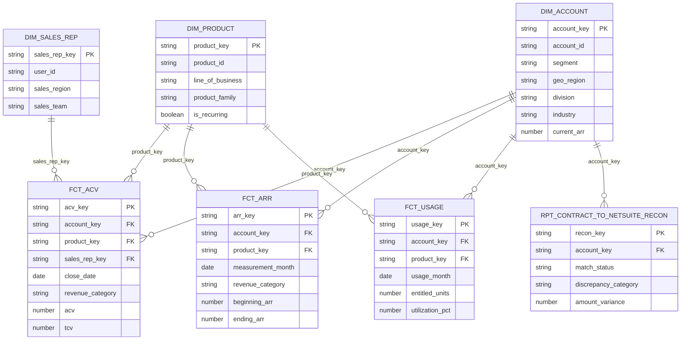
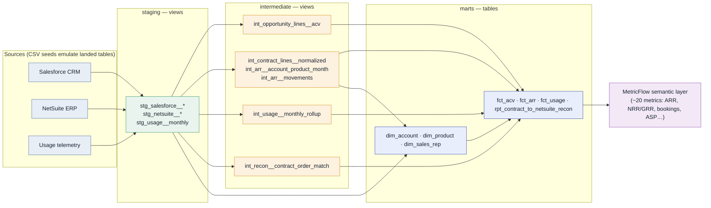
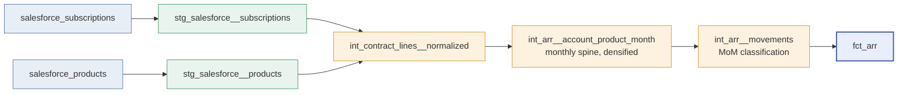
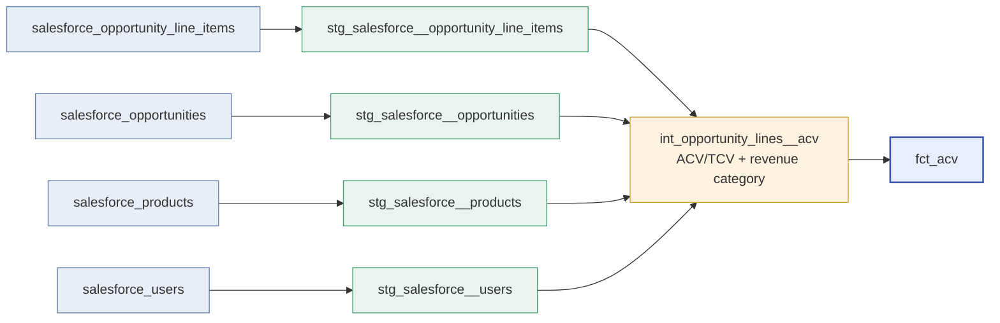
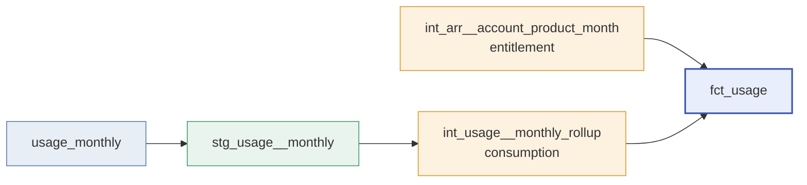
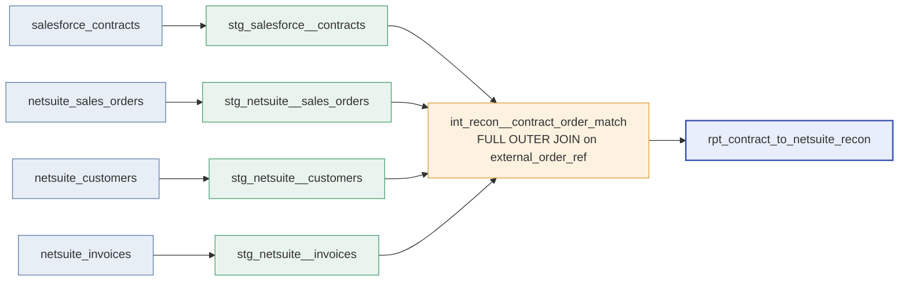
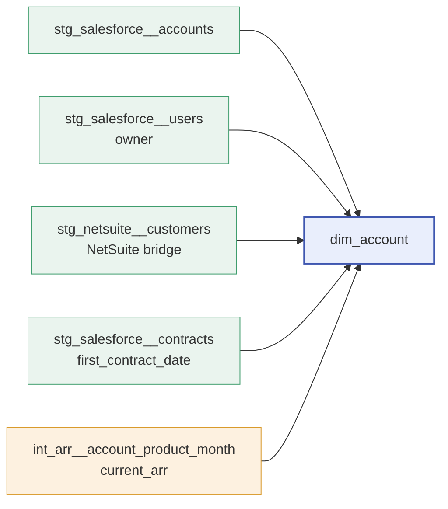

# Data model — ERD & lineage

How the marts relate to each other (ERD), and how each one is built up from the
Salesforce + NetSuite sources (DAGs). All diagrams are Mermaid and render directly on
GitHub.

---

## Entity-relationship diagram (the star schema)

Three conformed dimensions fan out to four facts via surrogate keys
(`account_key`, `product_key`, `sales_rep_key`).

**Grains:** `fct_acv` = one opportunity line · `fct_arr` = account × product × month-end ·
`fct_usage` = account × product × month · `rpt_contract_to_netsuite_recon` = contract ↔ order.

---

## End-to-end lineage

Sources → seeds → staging (views) → intermediate (views) → marts (tables) → semantic layer.

---

## How each mart is built

### `fct_arr` — the ARR waterfall

### `fct_acv` — bookings & pipeline

### `fct_usage` — consumption vs entitlement

### `rpt_contract_to_netsuite_recon` — Salesforce ↔ NetSuite

### `dim_account` — conformed customer dimension

> `dim_product` (stg_salesforce__products + stg_netsuite__items) and `dim_sales_rep`
> (stg_salesforce__users) are direct staging → dimension build-ups.
